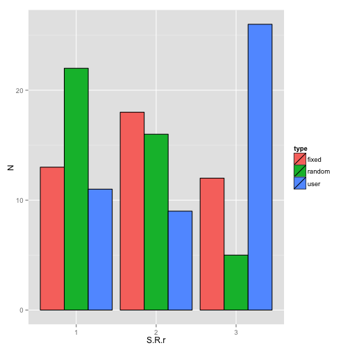

# CFQ Analyses for IARPA Final Report
**Creator(s)**: _Joe Tidwell_
**Date**: _20150618_


```
## Error in library("multicore", quietly = TRUE): there is no package called 'multicore'
```


## Raw Data Summary


|                          |                                                          |
|--------------------------|----------------------------------------------------------|
| Unique IFPs              | 111                       |
| Closed (scorable) IFPS   | 33                            |
| Unique Forecasters       | 379                     |
| Unique Forecasts         | 24692                                          |
| Unfittable Forecasts     | 522                                   |
| % Unfittable             | 2.11          |
| Mean $R^2$               | 0.9913017                                  |
| # $R^2 < 0$              | 30                                    |
| % $R^2 < 0$              | 0.12           |
| # Forecasts after closed | 3161 |
|                          |                                                          |


## Forecaster Level

### Effect of conditions (None)


<table style="text-align:center"><tr><td colspan="3" style="border-bottom: 1px solid black"></td></tr><tr><td style="text-align:left"></td><td colspan="2"><em>Dependent variable:</em></td></tr>
<tr><td></td><td colspan="2" style="border-bottom: 1px solid black"></td></tr>
<tr><td style="text-align:left"></td><td colspan="2">y</td></tr>
<tr><td style="text-align:left"></td><td>(1)</td><td>(2)</td></tr>
<tr><td colspan="3" style="border-bottom: 1px solid black"></td></tr><tr><td style="text-align:left">factor(type)user</td><td>0.010</td><td></td></tr>
<tr><td style="text-align:left"></td><td>(0.008)</td><td></td></tr>
<tr><td style="text-align:left"></td><td></td><td></td></tr>
<tr><td style="text-align:left">factor(type)fixed</td><td>0.003</td><td>-0.007</td></tr>
<tr><td style="text-align:left"></td><td>(0.007)</td><td>(0.008)</td></tr>
<tr><td style="text-align:left"></td><td></td><td></td></tr>
<tr><td style="text-align:left">factor(type)random</td><td></td><td>-0.010</td></tr>
<tr><td style="text-align:left"></td><td></td><td>(0.008)</td></tr>
<tr><td style="text-align:left"></td><td></td><td></td></tr>
<tr><td style="text-align:left">Constant</td><td>0.496<sup>***</sup></td><td>0.506<sup>***</sup></td></tr>
<tr><td style="text-align:left"></td><td>(0.005)</td><td>(0.006)</td></tr>
<tr><td style="text-align:left"></td><td></td><td></td></tr>
<tr><td colspan="3" style="border-bottom: 1px solid black"></td></tr><tr><td style="text-align:left">Observations</td><td>9,179</td><td>9,179</td></tr>
<tr><td style="text-align:left">Log Likelihood</td><td>-1,678.470</td><td>-1,678.470</td></tr>
<tr><td style="text-align:left">Akaike Inf. Crit.</td><td>3,368.940</td><td>3,368.940</td></tr>
<tr><td style="text-align:left">Bayesian Inf. Crit.</td><td>3,411.688</td><td>3,411.688</td></tr>
<tr><td colspan="3" style="border-bottom: 1px solid black"></td></tr><tr><td style="text-align:left"><em>Note:</em></td><td colspan="2" style="text-align:right"><sup>*</sup>p<0.1; <sup>**</sup>p<0.05; <sup>***</sup>p<0.01</td></tr>
</table>

## Consensus Level

### Effect of conditions (Random < Fixed < User)


<table style="text-align:center"><tr><td colspan="4" style="border-bottom: 1px solid black"></td></tr><tr><td style="text-align:left"></td><td colspan="3"><em>Dependent variable:</em></td></tr>
<tr><td></td><td colspan="3" style="border-bottom: 1px solid black"></td></tr>
<tr><td style="text-align:left"></td><td colspan="3">ordered(S.R.r)</td></tr>
<tr><td style="text-align:left"></td><td>(1)</td><td>(2)</td><td>(3)</td></tr>
<tr><td colspan="4" style="border-bottom: 1px solid black"></td></tr><tr><td style="text-align:left">factor(type, levels = c("fixed", "random", "user"))random</td><td>-0.850<sup>**</sup></td><td></td><td></td></tr>
<tr><td style="text-align:left"></td><td>(0.400)</td><td></td><td></td></tr>
<tr><td style="text-align:left"></td><td></td><td></td><td></td></tr>
<tr><td style="text-align:left">factor(type, levels = c("fixed", "random", "user"))user</td><td>0.905<sup>**</sup></td><td></td><td></td></tr>
<tr><td style="text-align:left"></td><td>(0.407)</td><td></td><td></td></tr>
<tr><td style="text-align:left"></td><td></td><td></td><td></td></tr>
<tr><td style="text-align:left">factor(type, levels = c("random", "user", "fixed"))user</td><td></td><td>1.755<sup>***</sup></td><td></td></tr>
<tr><td style="text-align:left"></td><td></td><td>(0.425)</td><td></td></tr>
<tr><td style="text-align:left"></td><td></td><td></td><td></td></tr>
<tr><td style="text-align:left">factor(type, levels = c("random", "user", "fixed"))fixed</td><td></td><td>0.850<sup>**</sup></td><td></td></tr>
<tr><td style="text-align:left"></td><td></td><td>(0.400)</td><td></td></tr>
<tr><td style="text-align:left"></td><td></td><td></td><td></td></tr>
<tr><td style="text-align:left">factor(type, levels = c("user", "fixed", "random"))fixed</td><td></td><td></td><td>-0.905<sup>**</sup></td></tr>
<tr><td style="text-align:left"></td><td></td><td></td><td>(0.407)</td></tr>
<tr><td style="text-align:left"></td><td></td><td></td><td></td></tr>
<tr><td style="text-align:left">factor(type, levels = c("user", "fixed", "random"))random</td><td></td><td></td><td>-1.755<sup>***</sup></td></tr>
<tr><td style="text-align:left"></td><td></td><td></td><td>(0.425)</td></tr>
<tr><td style="text-align:left"></td><td></td><td></td><td></td></tr>
<tr><td colspan="4" style="border-bottom: 1px solid black"></td></tr><tr><td style="text-align:left">Observations</td><td>132</td><td>132</td><td>132</td></tr>
<tr><td style="text-align:left">Log Likelihood</td><td>-135.852</td><td>-135.852</td><td>-135.852</td></tr>
<tr><td colspan="4" style="border-bottom: 1px solid black"></td></tr><tr><td style="text-align:left"><em>Note:</em></td><td colspan="3" style="text-align:right"><sup>*</sup>p<0.1; <sup>**</sup>p<0.05; <sup>***</sup>p<0.01</td></tr>
</table>

 

